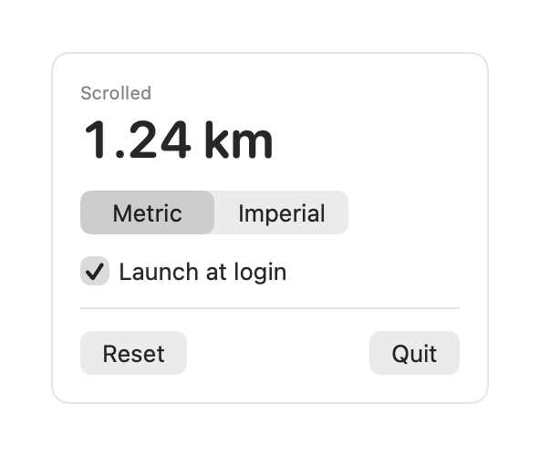

# ScrollDistance

A tiny macOS menu bar app that measures how far you've scrolled — and shows it as real-world distance, live, in your menu bar.

Every trackpad two-finger scroll and mouse-wheel turn is captured, converted from on-screen travel into physical distance using your display's actual size, and accumulated into a running total (meters/kilometers, or miles).

<p align="center">
  
</p>

## Features

- **Live menu bar readout** — your total distance, updating as you scroll.
- **Trackpad + mouse wheel** — both are measured.
- **Metric or Imperial** — switch between m/km and ft/mi from the dropdown.
- **Persistent** — your total survives quit and relaunch.
- **Launch at login** — optional, toggled from the dropdown.
- **No permissions required** — scroll monitoring needs no Accessibility or Input Monitoring grant.
- **Local only** — nothing leaves your Mac.

## Install

1. Download `ScrollDistance-x.y.z.dmg` from the [Releases](https://github.com/ephraimduncan/scroll-distance/releases) page.
2. Open it and drag **ScrollDistance** into **Applications**.
3. Launch it — the distance appears in your menu bar (the app has no Dock icon).

> The app is ad-hoc signed (not notarized). On first launch macOS may warn it's from an
> unidentified developer — right-click the app and choose **Open**, or run
> `xattr -dr com.apple.quarantine /Applications/ScrollDistance.app`.

## Usage

Click the menu bar reading to open the panel:

- **Units** — Metric / Imperial.
- **Launch at login** — start measuring automatically after you log in.
- **Reset** — set the total back to zero.
- **Quit** — exit the app.

## Build from source

Requires macOS 13+ and Xcode 15+ (built here with Xcode 27 beta), plus [XcodeGen](https://github.com/yonaskolb/XcodeGen).

```sh
brew install xcodegen
xcodegen generate
xcodebuild -project ScrollDistance.xcodeproj -scheme ScrollDistance -configuration Release build
```

## How it works

- A single `NSEvent` global monitor observes `.scrollWheel` events system-wide.
- Vertical scroll deltas are summed in points (mouse-wheel "line" deltas are scaled to points).
- Inertial/momentum scrolling is included — it's real on-screen movement.
- Points are converted to physical distance per display via `CGDisplayScreenSize` (the panel's real millimeters), with a sensible fallback when a display reports no size.

## Requirements

- macOS 13 (Ventura) or later.

## License

[MIT](LICENSE) © Ephraim Duncan
